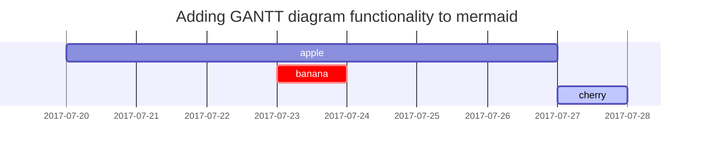

---

title: 博客模板
date: 2024-01-10 21:13:00 +0800
categories: [博客, 模板]
tags: [模板]
authors: [badbadyi, 马甲]
toc: true
comments: true
math: true
mermaid: true
pin: true
image:
  path: https://badbadyi-1321478328.cos.ap-chongqing.myqcloud.com/wallpaper/p5r.jpg
  alt: P5R 神中神

---

记录本博客常用语法

快捷键指代 Typora 快捷键

<!-- more -->

## 标题

 `Ctrl + 1/2/3/4`

```md
# 一级标题

## 二级标题

### 三级标题

#### 四级标题
```

## 段落

这是一个段落这是一个段落这是一个段落这是一个段落这是一个段落这是一个段落这是一个段落这是一个段落这是一个段落这是一个段落这是一个段落这是一个段落这是一个段落这是一个段落这是一个段落这是一个段落

```md
这是一个段落这是一个段落这是一个段落这是一个段落这是一个段落这是一个段落这是一个段落这是一个段落这是一个段落这是一个段落这是一个段落这是一个段落这是一个段落这是一个段落这是一个段落这是一个段落
```

## 列表

### 顺序列表

 `Ctrl + Shift + [`

1. 第一
2. 第二
3. 第三

```md
1. 第一
2. 第二
3. 第三
```

### 无序列表

快捷键 `Ctrl + Shift + ]`

- 大章
  - 小节
    - 段落

```md
- Chapter
  + Section
    * Paragraph

- Chapter
  - Section
    - Paragraph
```

### 待办列表

`Ctrl + Shift + X`

- [ ] 工作
  + [x] 步骤 1
  + [x] 步骤 2
  + [ ] 步骤 3

```md
- [ ] 工作
  + [x] 步骤 1
  + [x] 步骤 2
  + [ ] 步骤 3
```


### 描述列表

Sun
: the star around which the earth orbits

Moon
: the natural satellite of the earth, visible by reflected light from the sun

```md
Sun
: the star around which the earth orbits

Moon
: the natural satellite of the earth, visible by reflected light from the sun
```

## 块引用

 `Ctrl + Shift + Q` 

> Where there's a will there's a way.

`Ctrl + I`

*block quote*

```md
> Where there's a will there's a way.

*block quote*
_block quote_
```

## 提示

> An example showing the `tip` type prompt.
{: .prompt-tip }

> An example showing the `info` type prompt.
{: .prompt-info }

> An example showing the `warning` type prompt.
{: .prompt-warning }

> An example showing the `danger` type prompt.
{: .prompt-danger }

```md
> An example showing the `tip` type prompt.
{: .prompt-tip }

> An example showing the `info` type prompt.
{: .prompt-info }

> An example showing the `warning` type prompt.
{: .prompt-warning }

> An example showing the `danger` type prompt.
{: .prompt-danger }
```

## 表格

`Ctrl + T`

| Company                      | Contact          | Country |
|:-----------------------------|:-----------------|--------:|
| Alfreds Futterkiste          | Maria Anders     | Germany |
| Island Trading               | Helen Bennett    | UK      |
| Magazzini Alimentari Riuniti | Giovanni Rovelli | Italy   |

```md
| Company                      | Contact          | Country |
|:-----------------------------|:-----------------|--------:|
| Alfreds Futterkiste          | Maria Anders     | Germany |
| Island Trading               | Helen Bennett    | UK      |
| Magazzini Alimentari Riuniti | Giovanni Rovelli | Italy   |
```

## 链接

<https://www.google.com>

```md
<https://www.google.com>
```

## 脚注

Click the hook will locate the footnote[^footnote], and here is another footnote[^fn-nth-2].

```md
Click the hook will locate the footnote[^footnote], and here is another footnote[^fn-nth-2].
```

## 行间代码

 `Ctrl + Shift + ~` 

这是一个行间代码的例子 `Hello there`

```md
这是一个行间代码的例子 `Hello there`
```

## 文件路径

Here is the `/path/to/the/file.extend`{: .filepath}.

```md
Here is the `/path/to/the/file.extend`{: .filepath}.
```

## 代码块

`Ctrl + Shift + K`

### 普通代码块

演示

```
纯文本代码块
```

代码

~~~md
```
纯文本代码块
```
~~~

### 特定语言代码块

演示

```sh
if [ $? -ne 0 ]; then
  echo "The command was not successful.";
  #do the needful / exit
fi;
```

代码

~~~md
```sh
if [ $? -ne 0 ]; then
  echo "The command was not successful.";
  #do the needful / exit
fi;
```
~~~

### 特定文件代码块

```sass
@import
  "colors/light-typography",
  "colors/dark-typography";
```
{: file='_sass/jekyll-theme-chirpy.scss'}

~~~md
```sass
@import
  "colors/light-typography",
  "colors/dark-typography";
```
{: file='_sass/jekyll-theme-chirpy.scss'}
~~~
## 数学公式

The mathematics powered by [**MathJax**](https://www.mathjax.org/):

$$ \sum_{n=1}^\infty 1/n^2 = \frac{\pi^2}{6} $$

When $a \ne 0$, there are two solutions to $ax^2 + bx + c = 0$ and they are

$$ x = {-b \pm \sqrt{b^2-4ac} \over 2a} $$

```md
The mathematics powered by [**MathJax**](https://www.mathjax.org/):

$$ \sum_{n=1}^\infty 1/n^2 = \frac{\pi^2}{6} $$

When $a \ne 0$, there are two solutions to $ax^2 + bx + c = 0$ and they are

$$ x = {-b \pm \sqrt{b^2-4ac} \over 2a} $$
```

## Mermaid SVG



~~~md

~~~

## 视频嵌入



## 脚注跳转

[^footnote]: The footnote source
[^fn-nth-2]: The 2nd footnote source

```md
[^footnote]: The footnote source
[^fn-nth-2]: The 2nd footnote source
```

